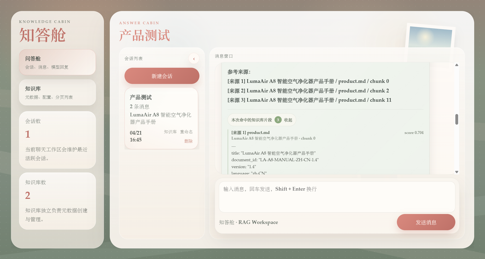

# 知答舱

知答舱是一个面向个人学习和小型知识库问答场景的 RAG 聊天工作台。项目使用 FastAPI 提供后端接口，Vue 构建前端交互界面，MySQL 保存会话和知识库元数据，Qdrant 保存文档向量索引，并通过 LangChain 接入兼容 OpenAI 协议的大模型服务。

项目目标不是只做一个最小聊天 Demo，而是提供一套可继续扩展的知识库问答基础能力：会话管理、知识库管理、文档上传与切分、向量检索、流式回答、命中来源展示，以及回答来源快照持久化。

## 预览



## 功能特性

- 多会话聊天：支持创建、重命名、删除会话，并持久化聊天历史。
- 流式输出：前端通过流式接口实时展示模型回答。
- 会话绑定知识库：每个会话可以选择一个或多个知识库作为检索范围。
- 检索增强问答：用户提问时自动检索当前会话绑定知识库，将命中的文档片段注入系统提示词。
- 来源片段展示：模型回答下方可展开查看本次命中的知识库片段。
- 来源快照持久化：命中的来源片段随 assistant 消息保存，刷新页面后仍可查看。
- 知识库管理：支持创建、编辑、删除知识库，分页浏览，上传文档和删除文档。
- 文档向量化：支持 `TXT / MD / PDF` 文档上传，按知识库配置切分并写入 Qdrant。
- 二阶段精排：可选调用阿里百炼 `qwen3-vl-rerank` 对向量召回片段重新排序，提高 RAG 上下文相关性。
- 降级处理：知识库无命中、空知识库或检索异常时，不阻断普通聊天。

## 技术栈

| 模块 | 技术 |
| --- | --- |
| 前端 | Vue 3, Vite |
| 后端 | FastAPI, Pydantic, SQLAlchemy |
| LLM 编排 | LangChain |
| 聊天模型 | `langchain_openai.ChatOpenAI`，默认接入阿里百炼兼容接口 |
| Rerank | 阿里百炼 `qwen3-vl-rerank`，默认关闭，可通过环境变量启用 |
| 结构化存储 | MySQL |
| 向量数据库 | Qdrant |
| 文档解析 | pypdf, 文本解析 |
| Python 包管理 | uv |

## 系统架构

```text
┌─────────────┐
│   Vue UI    │
└──────┬──────┘
       │ HTTP / NDJSON Stream
┌──────▼──────┐
│  FastAPI    │
└──────┬──────┘
       │
       ├── ChatService
       │   ├── 读取会话历史和绑定知识库
       │   ├── 调用 KnowledgeBaseService 做向量检索
       │   ├── 构造动态 system prompt
       │   └── 调用 LLM 并保存消息
       │
       ├── KnowledgeBaseService
       │   ├── 文档上传、解析、切分
       │   ├── Embedding 向量化
       │   └── Qdrant collection 管理和检索
       │
       ├── MySQL
       │   ├── 会话、消息、知识库、文档状态
       │   └── assistant 消息的来源片段快照
       │
       └── Qdrant
           └── 文档 chunk 向量和 payload
```

## 目录结构

```text
.
├── backend/
│   ├── config.py
│   ├── db.py
│   ├── main.py
│   ├── models.py
│   ├── schemas.py
│   ├── sql/
│   │   └── mysql_schema.sql
│   └── services/
│       ├── chat_service.py
│       └── knowledge_base_service.py
├── frontend/
│   ├── package.json
│   └── src/
│       ├── App.vue
│       ├── api.js
│       └── style.css
├── docs/
│   └── images/
│       └── app-preview.png
├── .env.example
├── pyproject.toml
├── uv.lock
└── README.md
```

## 环境要求

- Python 3.10+
- Node.js 18+
- MySQL 8.0+
- Qdrant 1.8+
- 可用的大模型 API Key，默认使用阿里百炼 OpenAI 兼容模式

## 快速开始

### 1. 克隆项目并安装依赖

```bash
uv sync
```

如果本机尚未安装 `uv`，可以参考 uv 官方安装方式，或先执行：

```bash
curl -LsSf https://astral.sh/uv/install.sh | sh
```

安装前端依赖：

```bash
cd frontend
npm install
```

### 2. 配置环境变量

复制后端环境变量模板：

```bash
cp .env.example .env
```

主要配置项如下：

```env
DASHSCOPE_API_KEY=your_dashscope_api_key
DASHSCOPE_BASE_URL=https://dashscope.aliyuncs.com/compatible-mode/v1
DASHSCOPE_DEFAULT_MODEL=qwen-plus
EMBEDDING_BASE_URL=https://dashscope.aliyuncs.com/compatible-mode/v1
RERANK_ENABLED=false
RERANK_MODEL=qwen3-vl-rerank
RERANK_BASE_URL=https://dashscope.aliyuncs.com/api/v1/services/rerank/text-rerank/text-rerank
RERANK_CANDIDATE_TOP_K=20
RERANK_TOP_N=5
RERANK_TIMEOUT_SECONDS=15
RERANK_SCORE_THRESHOLD=
RERANK_INSTRUCT=Given a web search query, retrieve relevant passages that answer the query.

MYSQL_HOST=127.0.0.1
MYSQL_PORT=3306
MYSQL_USER=root
MYSQL_PASSWORD=your_mysql_password
MYSQL_DATABASE=langchain_chatbot

QDRANT_URL=http://127.0.0.1:6333
QDRANT_API_KEY=
QDRANT_COLLECTION_PREFIX=kb
DOCUMENT_STORAGE_ROOT=backend/storage/knowledge_bases
MAX_DOCUMENT_SIZE_BYTES=20971520

API_HOST=0.0.0.0
API_PORT=8000
BACKEND_CORS_ORIGINS=http://localhost:5173
```

复制前端环境变量模板：

```bash
cd frontend
cp .env.example .env
```

默认内容：

```env
VITE_API_BASE_URL=http://localhost:8000/api
```

### 3. 初始化 MySQL

先创建数据库：

```sql
CREATE DATABASE IF NOT EXISTS langchain_chatbot
  DEFAULT CHARACTER SET utf8mb4
  DEFAULT COLLATE utf8mb4_unicode_ci;
```

然后执行建表脚本：

```bash
mysql -u root -p langchain_chatbot < backend/sql/mysql_schema.sql
```

如果是已有数据库，后端启动时会自动补齐部分向后兼容字段，例如 `chat_messages.retrieved_chunks`。

### 4. 启动 Qdrant

可以使用本地服务或 Docker。Docker 示例：

```bash
docker run -p 6333:6333 -p 6334:6334 qdrant/qdrant
```

### 5. 启动后端和前端

启动后端：

```bash
uv run uvicorn backend.main:app --reload
```

启动前端：

```bash
cd frontend
npm run dev
```

默认访问地址：

- 前端：`http://localhost:5173`
- 后端：`http://localhost:8000`
- API 文档：`http://localhost:8000/docs`

## 使用流程

1. 在知识库页面创建知识库，设置 embedding 模型、chunk 大小、重叠长度等配置。
2. 上传 `TXT / MD / PDF` 文档，等待文档状态变为 `ready`。
3. 创建或编辑会话，绑定需要参与检索的知识库。
4. 在聊天窗口提问，后端会在绑定知识库中做向量检索。
5. 模型回答生成后，可以点击回答下方的“本次命中的知识库片段”查看来源内容。

## 核心接口

### 会话接口

| 方法 | 路径 | 说明 |
| --- | --- | --- |
| `GET` | `/api/sessions` | 获取会话列表 |
| `POST` | `/api/sessions` | 创建会话 |
| `PATCH` | `/api/sessions/{session_id}` | 重命名会话 |
| `PUT` | `/api/sessions/{session_id}/knowledge-bases` | 替换会话绑定知识库 |
| `DELETE` | `/api/sessions/{session_id}` | 删除会话 |
| `GET` | `/api/sessions/{session_id}/messages` | 获取会话消息 |
| `POST` | `/api/sessions/{session_id}/messages` | 普通非流式问答 |
| `POST` | `/api/sessions/{session_id}/messages/stream` | 流式问答 |

### 知识库接口

| 方法 | 路径 | 说明 |
| --- | --- | --- |
| `GET` | `/api/knowledge-bases` | 分页获取知识库 |
| `GET` | `/api/knowledge-bases/options` | 获取会话选择器选项 |
| `POST` | `/api/knowledge-bases` | 创建知识库 |
| `PATCH` | `/api/knowledge-bases/{knowledge_base_id}` | 编辑知识库名称和描述 |
| `DELETE` | `/api/knowledge-bases/{knowledge_base_id}` | 删除知识库及其文档和向量索引 |
| `GET` | `/api/knowledge-bases/{knowledge_base_id}/documents` | 获取知识库文档列表 |
| `POST` | `/api/knowledge-bases/{knowledge_base_id}/documents` | 上传文档 |
| `DELETE` | `/api/knowledge-bases/{knowledge_base_id}/documents/{document_id}` | 删除文档 |

创建知识库请求示例：

```json
{
  "name": "产品文档库",
  "description": "用于存放产品手册和 FAQ",
  "config": {
    "embedding_model": "text-embedding-v1",
    "chunk_size": 500,
    "chunk_overlap": 50,
    "separator": "\\n\\n"
  }
}
```

## RAG 处理说明

一次用户提问的大致流程如下：

1. 读取当前 session 绑定的知识库。
2. 使用知识库配置中的 `embedding_model` 生成 query embedding。
3. 到对应 Qdrant collection 检索相关 chunk。
4. 按 Top K、分数阈值和上下文长度上限筛选片段。
5. 将命中片段拼接到动态 system prompt。
6. 调用 LLM 生成回答。
7. 将用户消息、assistant 消息和命中来源片段快照写入 MySQL。

Qdrant payload 使用以下字段：

- `knowledge_base_id`
- `document_id`
- `original_filename`
- `chunk_index`
- `text`

## 数据存储

- `chat_sessions`：会话元数据。
- `chat_messages`：聊天消息，以及 assistant 消息命中的来源片段快照。
- `session_knowledge_bases`：会话与知识库的绑定关系。
- `knowledge_bases`：知识库元数据和切分配置。
- `knowledge_base_documents`：文档上传记录、处理状态和 chunk 数量。
- `DOCUMENT_STORAGE_ROOT`：原始上传文档的本地存储目录。
- Qdrant collection：文档切分后的向量块，collection 名称格式为 `{QDRANT_COLLECTION_PREFIX}_{knowledge_base_id}`。

## 开发命令

后端语法检查：

```bash
uv run python -m compileall backend
```

前端构建：

```bash
cd frontend
npm run build
```

## 后续规划

- 用户体系与知识库权限隔离。
- Docker Compose 一键启动 MySQL、Qdrant、后端和前端。
- 更细粒度的检索参数配置。
- 支持更多文档格式和异步文档处理队列。
- 为 RAG 检索、文档解析和接口行为补充自动化测试。
